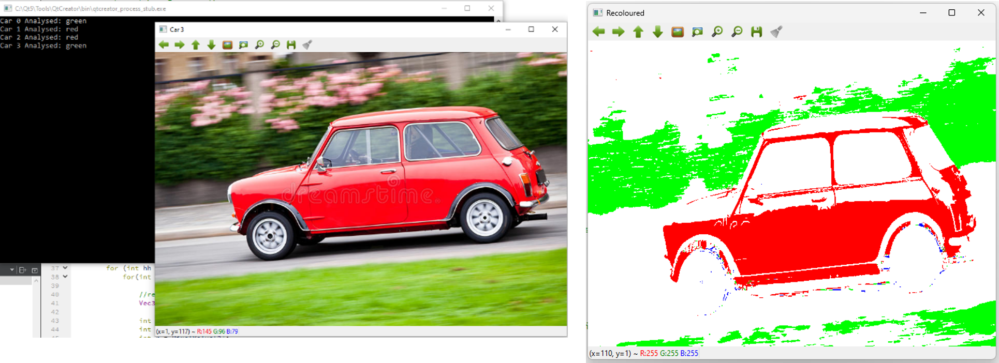
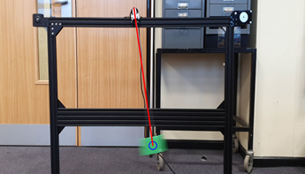
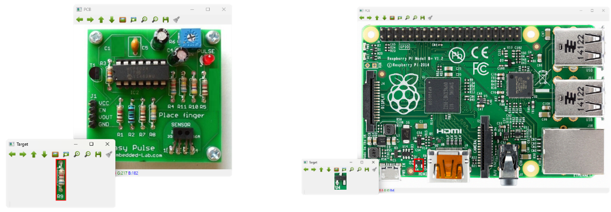
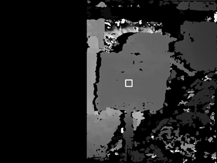
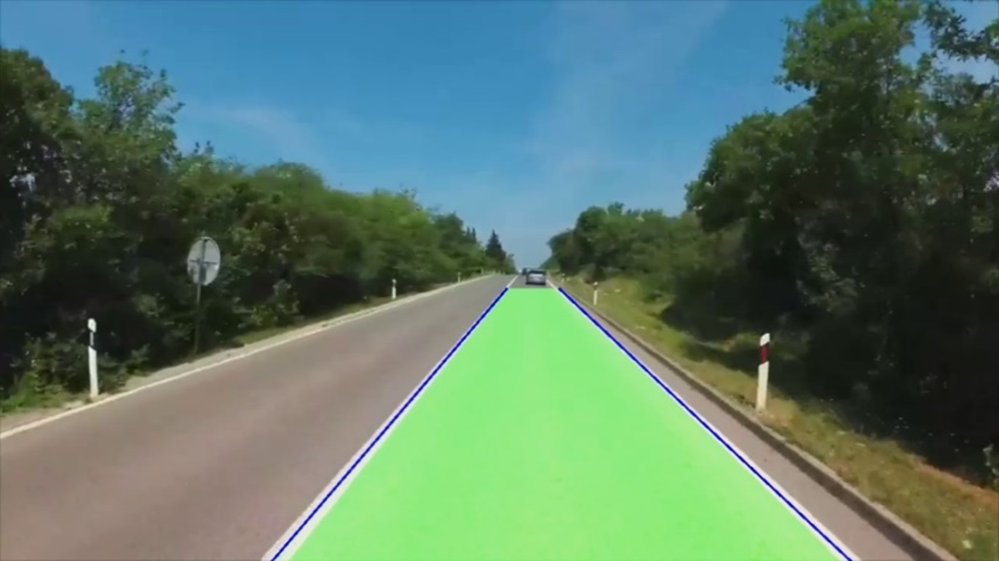

# Computer Vision Fundamentals

### Requirements
- Qt Creator
- OpenCV with C++ 

### Task 1
An online car dealership has a database of cars for sale and would like to give customers the ability to search based on the cars colour. To do this, all cars in the database will have to be tagged with a colour. The database is too big to do this manually, so can you create a computer vision solution to identify the colour of each car?

### Task 2
A researcher wishes to use a pendulum for an experiment but needs to know the friction of its pivot. One way to measure this is to swing the pendulum and observe the decay rate of the oscillation. To do so, the angle of the pendulum must be measured at small time intervals. A camera was placed in front of the setup, and a bright colour target was attached to the end of pendulum. Write a program to detect the colour target and measure the angle of the pendulum over time.

### Task 3
A PCB manufacture wants to automate part of its quality control, as a few key components have a high failure rate during the pick-and-place phase. Assure that all these components are in place by locating them on the PCB.

### Task 4
A robot is to be designed to navigate an environment, and thus must detect its surroundings. Rather than using LiDAR or ultrasonic sensors, the designer has opted to use stereo cameras. Calibrate the cameras and use disparity mapping to build a 3D representation of the room.

### Task 5
One of the most complex computer vision applications is in the growing field of autonomous driving cars. Cameras around the car capture a great deal of information, however breaking this down into useful data is a huge challenge. In this task, you are required to program a small part of this system, lane detection.

