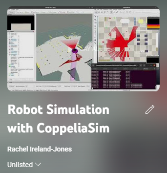

# Robot Simulation in CoppeliaSim with ROS </h1>

### Nov 2022 </h3>

_**This project was assigned by university as a practical way to learn about ROS, CoppeliaSim and SLAM.**_

This involved developing an application in the Robot Operating System (ROS) which enabled a wheeled mobile robot simulated in CoppeliaSim to follow a trajectory given as input by a human operator via a User Graphical Interface (GUI).  

#### Software Used:
* ROS
* CoppeliaSim
* Linux

## DEPENDENCIES
1. `gmapping`
2. `octomap`
3. `joy`

## MAKE THE WORKSPACE
1. Open the terminal and navigate to the workspace folder **/path_following_wss**
2. Clean the workspace with `$ ./del.sh`
3. Install all dependencies by running `$ ./install.sh`
4. Compile all the workspaces by running the command: `$ ./make.sh` (It may be necessary to run this command twice in order for it to build completely)
5. If for any reason you need to remake the workspace, use the command `$ ./del.sh` to clean the workspace and compile the workspaces again.

## HOW TO RUN:

### Run with keyboard control
`$ ./run.sh` 
To run CoppeliaSim, RVIZ and all additional nodes required for keyboard control, run the bash file `$ ./run.sh`. 
This will open one terminal tab for each node. 
If you close any of the terminal tabs created they can be reopened with the individual bash file for each element.

When the keyboard control node initially runs, the robot velocity is very low. Following the instructions on the terminal, this velocity can be increased. We recommend a linear velocity of about 4 and a angular velocity of about 2. 

Line 61 of the pioneer3dx child script in coppeliaSim scene `Pioneer3dx_office_world.ttt` must be commented. 

### Run with path planning
`$ ./run_path.sh` 
We have set up a second bash file to run CoppeliaSim, RVIZ and all nodes required for path planning, to do this run the bash file `$ ./run_path.sh`. Line 61 of the pioneer3dx child script in coppeliaSim scene `Pioneer3dx_office_world.ttt` must be un-commented*. 

### How to run individual nodes (if necessary)
- `copp.sh` for coppeliaSim
- `rviz.sh` for RVIZ with LaserScan and PointCloud
- `keyb.sh` for Keyboard Control
- `slam.sh` for 2D SLAM via gmapping
- `octo.sh` for octomapping
- `stig.sh` for StigmergyPlanner (requires octomap to be running)
- `traj.sh` for TrajectoryControl (requires gmapping to NOT be running*)

*due to a bug, path planning cannot be completed whilst gmapping is running as `trajectory_controller.launch` has an extrapolation errror. Line 61 of the pioneer3dx child script in coppeliaSim scene `Pioneer3dx_office_world.ttt` must be un-commented and gmapping must not be running.

## ADDITIONAL INFORMATION
1. `execute.sh` can be used to make sure every required file is executable with `$ ./execute.sh`(this has been tested but not exhaustively)
2. `source.bash` can be used to source a new terminal when needed with `$ source source.bash`

## VIDEO DEMONSTRATION OF WORK

- [Full Playlist](https://youtube.com/playlist?list=PLtLvw-PrujQvp0nf3MNJbLN1I8ItokA28)
- [Task 1 - SLAM](https://youtu.be/xZEUxM2lPPs)
- [Task 2 - 3D Mapping](https://youtu.be/xZEUxM2lPPs)
- [Task 3 - GUI Path Drawing](https://youtu.be/sbJzJu5pBRQ)
- [Task 4 - Path Following](https://youtu.be/ebUGcWVkG4E)
