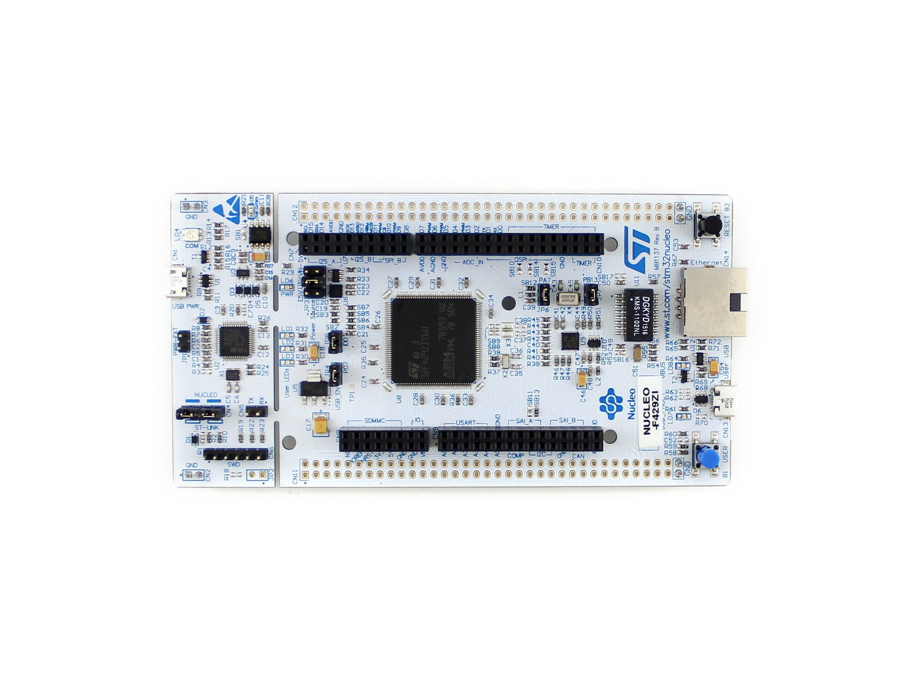
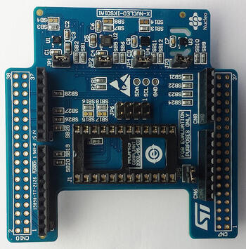

<h1> Tremor Analysis Tool </h1>

<h3> Nov 2022 </h3>

_**This project was assigned by university as a practical way to learn about embedded C++ code, multi-threading and embedded sensors.**_

Using an STM32F429Zi Nucleo Board and a "Module Support Board" designed by the university, I designed a multi-threaded software solution to detect tremors and calculate the frequency of the movement. The solution contained both a simulated result (when a MEMs board was not connected) and a 

#### Hardware Used:
* Nucleo F429ZI  
* Module Support Board    
* ST X-Nucleo-IKS01A1 MEMS board    

#### Software Used:
* Mbed Studio
* Github Desktop
* [Starter Project](https://classroom.github.com/a/wZPq2RWk) (Mbed Studio Project and Workspace)
