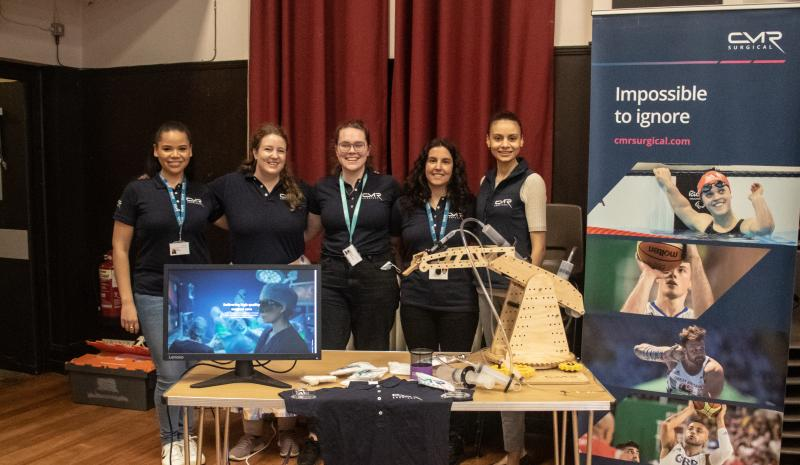

# [CMR Surgical](https://cmrsurgical.com/)

_July 5th 2023 - September 2nd 2023_

### Company

> Who we are. CMR Surgical is here to transform surgery. We are on a mission to deliver an evidence based approach to surgical robotics. Our goal is to empower surgeons, surgical teams and hospitals to transform how surgery is performed across the world.

### Role
My year in the company took place within the Research and Strategy department. I was in the Robotics team which meant that I worked on both hardware and software _proof of concept_ projects that were then presented to the senior leadership team. If these projects were approved they would then progress to the development pipeline. Due to an NDA, I cannot go into detail about the projects I completed whilst at CMR, however, I have added brief descriptions of the timeframes, scripting languages and skills developed across my time. The team used Agile methods and organised work using Jira and Confluence which gave me a good insight into industry systems. 

### Projects
1. **VersiusVR**
   - C# and C++
   - 6 months
   - mostly my own project with supervision
  
1. **VNC** 
   - JavaScript, CSS, Node.js
   - 4 months
   - my own project with supervision
    
1. **User Interface Re-Design**
   - Python with pygame-gui module
   - 6 months
   - 2 person team
     
1. **Analysis of hardware results**
   - Jupyter Notebooks
   - 3 months
   - 3 person team
     
1. ** Data Analysis of Robot Pose**
   - AWS telemetry
   - 3 months
   - C#, Unity, Blender
     

### Outreach
At the beginning of April 2022, I visited Hills Road Sixth Form as a representative of CMR to attend Robocon, a free-to-access introduction to robotics for GCSE-aged students in East Anglia.

At the beginning of my engineering career (2016) I was coerced by two incredible teachers to join an all-girls team to take part in a video competition and apply for funding to compete in [VEX Robotics](../VEX%20Robotics/).

The video topic was "What is engineering?" and the process of its creation was the first time I really realised that engineering wasn't only for guys - and didn't have to mean designing cars or working with concrete and steel but could instead mean solving problems I was passionate about.

We succeeded in getting funding and for two years I was fortunate enough to take part in VEX. I loved every second of the experience - occasionally forgetting to prioritise schoolwork - and attribute the entire experience to being the reason I am doing robotics today.

Robocon was an awesome experience to reflect on my own entry to robotics and hope that just as I was inspired in 2016, Hills Road and CMR have inspired some new kids to pursue a career in STEM.

